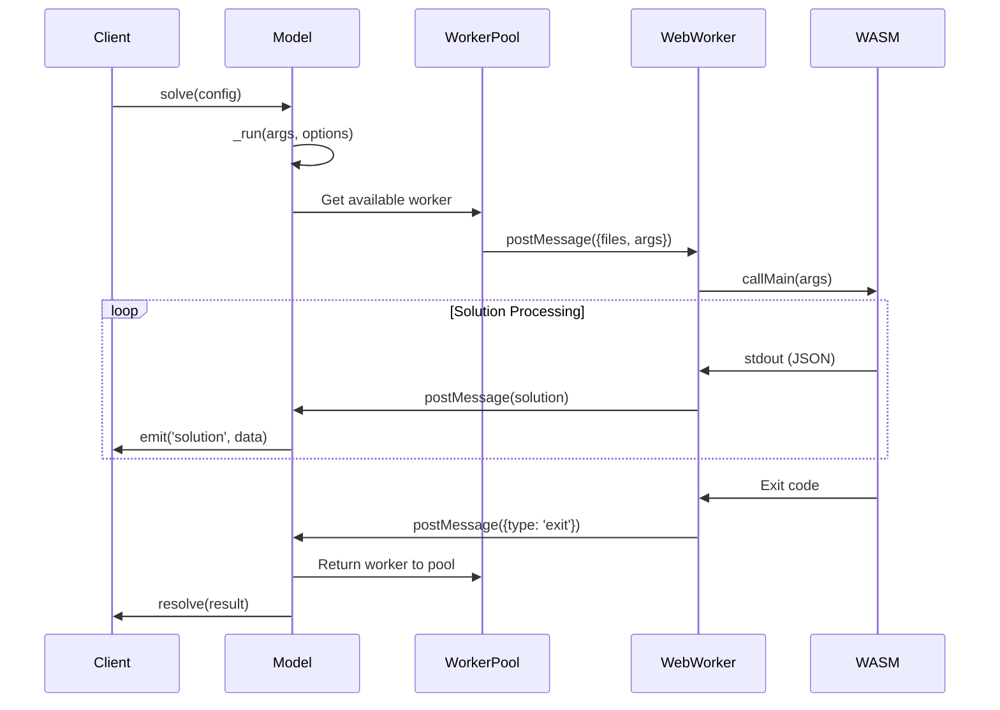
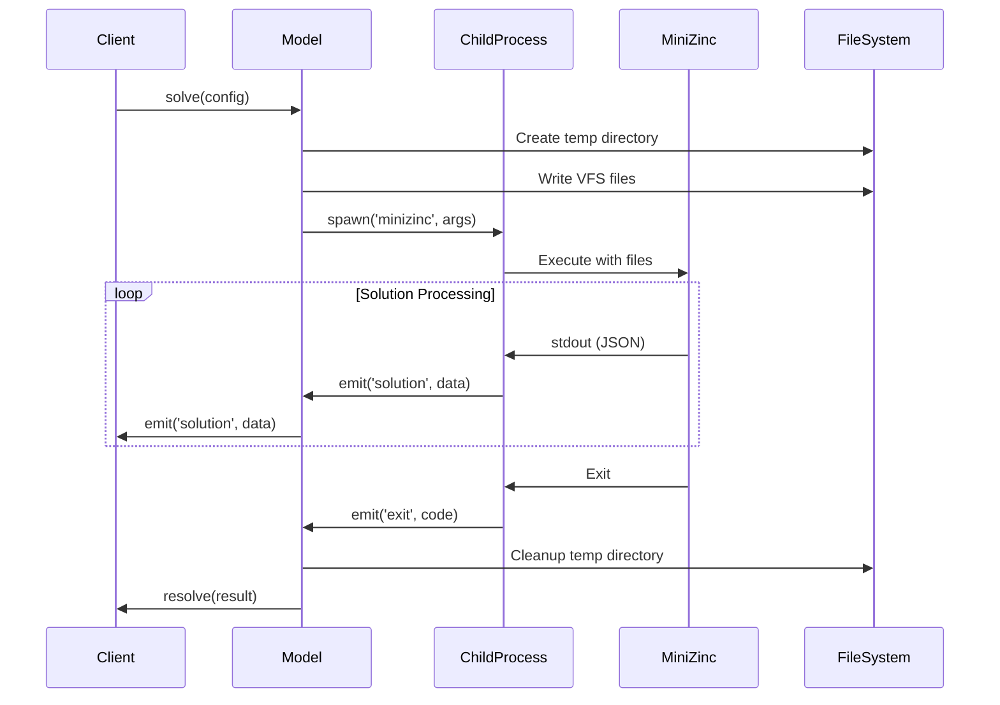

# MiniZinc JavaScript Implementation Notes

## Project Overview

**MiniZinc.js** is a JavaScript API wrapper for the MiniZinc constraint programming system. It provides a unified interface for running MiniZinc models in both browser (via WebAssembly) and Node.js (via native MiniZinc installation) environments. The library enables JavaScript applications to create, compile, and solve constraint satisfaction and optimization problems using MiniZinc.

**Key Capabilities:**
- Cross-platform support (Browser WebAssembly + Node.js native)
- Unified API for both environments
- Event-driven solving with real-time progress monitoring
- Support for all MiniZinc file formats (.mzn, .dzn, .json, .mpc, .fzn)
- Virtual file system for in-memory model composition
- Comprehensive error handling and debugging support

## Architecture Overview

### Dual-Platform Architecture

The library implements a **dual-platform strategy** with environment-specific implementations:

```
┌─────────────────────┐    ┌─────────────────────┐
│    Browser (WASM)   │    │    Node.js (Native) │
├─────────────────────┤    ├─────────────────────┤
│ • Web Workers       │    │ • Child Processes   │
│ • WebAssembly       │    │ • File System       │
│ • Blob URLs         │    │ • Native MiniZinc   │
│ • Virtual FS        │    │ • Temp Directories  │
└─────────────────────┘    └─────────────────────┘
           │                            │
           └──────────┬───────────────────┘
                      │
            ┌─────────────────────┐
            │   Unified Model API │
            │                     │
            │ • solve()           │
            │ • compile()         │
            │ • check()           │
            │ • interface()       │
            └─────────────────────┘
```

### Core Components

#### 1. Model Class (`src/browser.js` & `src/node.js`)
- **Primary interface** for all MiniZinc operations
- Manages virtual file system (VFS) for model files
- Provides unified methods across platforms
- Handles file addition, model composition, and execution

#### 2. Browser Implementation (`src/browser.js`)
- **Worker Pool Management**: Maintains pool of Web Workers for parallel execution
- **WebAssembly Integration**: Loads and manages MiniZinc WASM module
- **Virtual File System**: In-memory file storage using JavaScript objects
- **Worker Lifecycle**: Automatic worker recycling after 10 uses to prevent memory leaks

#### 3. Node.js Implementation (`src/node.js`)
- **Child Process Management**: Spawns native MiniZinc processes
- **File System Integration**: Uses temporary directories for file I/O
- **Process Pool**: Tracks active processes for cleanup
- **Stream Processing**: Handles stdout/stderr parsing with readline

#### 4. Web Worker (`src/worker.js`)
- **WASM Module Loading**: Initializes MiniZinc WebAssembly runtime
- **JSON Stream Processing**: Parses MiniZinc's JSON output format
- **File Path Normalization**: Strips temporary path prefixes from error messages
- **Standard Library Access**: Provides access to MiniZinc's built-in libraries

## Execution Flow Analysis

### Browser Execution Flow



### Node.js Execution Flow



## File System Abstraction

### Virtual File System (VFS)

Both implementations use a **virtual file system** abstraction:

```javascript
// Browser: In-memory object
this.vfs = {
  'model.mzn': 'var 1..3: x;',
  'data.dzn': 'y = 5;',
  'config.json': '{"solver": "gecode"}'
}

// Node.js: Temporary directory mapping
// /tmp/mzn_xyz123/model.mzn -> 'var 1..3: x;'
// /tmp/mzn_xyz123/data.dzn -> 'y = 5;'
```

### File Management Strategies

#### Browser Strategy
- **Memory-based**: All files stored in JavaScript objects
- **Worker Transfer**: Files transferred to worker via `postMessage`
- **Path Security**: URL validation prevents directory traversal
- **No Persistence**: Files exist only during execution

#### Node.js Strategy
- **Temporary Directories**: Uses `os.tmpdir()` with unique prefixes
- **File I/O**: Physical files written to disk
- **Path Resolution**: Converts virtual paths to absolute paths
- **Cleanup**: Automatic directory removal after execution

## Worker Pool Management

### Browser Worker Pool

The browser implementation uses a sophisticated worker pool system:

```javascript
const workers = [];
let settings = {
  workerURL: new URL('./minizinc-worker.js', URL_BASE),
  numWorkers: 2,  // Default pool size
};

function newWorker() {
  // Create worker with dynamic import
  const importer = `importScripts(${JSON.stringify(settings.workerURL)});`;
  workerObjectURL = URL.createObjectURL(
    new Blob([importer], { type: "text/javascript" })
  );
  const worker = new Worker(workerObjectURL);
  workers.push({ worker, runCount: 0 });
}
```

**Key Features:**
- **Dynamic Pool Sizing**: Automatically maintains `numWorkers` active workers
- **Worker Recycling**: Workers terminated after 10 uses to prevent memory leaks
- **Blob URL Management**: Creates dynamic worker scripts with proper imports
- **Load Balancing**: Uses simple round-robin worker selection

### Process Management (Node.js)

```javascript
const childProcesses = new Set();

export function shutdown() {
  // Cleanup all active processes
  for (const proc of childProcesses) {
    proc.kill("SIGKILL");
  }
  childProcesses.clear();
}
```

## Event System Architecture

### JSON Stream Processing

Both implementations parse MiniZinc's **JSON Stream** output format:

```javascript
// Example JSON stream output from MiniZinc:
{"type": "solution", "output": {"json": {"x": 1}}}
{"type": "statistics", "statistics": {"nSolutions": 1}}
{"type": "status", "status": "SATISFIED"}
{"type": "exit", "code": 0}
```

### Event Flow Transformation

#### Browser Event Processing

```javascript
worker.onmessage = (e) => {
  if (callbacks[e.data.type]) {
    for (const f of callbacks[e.data.type]) {
      f(e.data);  // Broadcast to all listeners
    }
  }
  
  switch (e.data.type) {
    case "solution":
      solution = e.data;
      status = "SATISFIED";
      break;
    case "statistics":
      statistics = { ...statistics, ...e.data.statistics };
      break;
    case "exit":
      worker.terminate();
      exited = true;
      break;
  }
};
```

#### Node.js Stream Processing

```javascript
const stdout = rl.createInterface(proc.stdout);
stdout.on("line", async (line) => {
  try {
    const obj = JSON.parse(line);
    // Path normalization for error messages
    if ("location" in obj && obj.location.filename.indexOf(tempdir) === 0) {
      obj.location.filename = obj.location.filename.substring(tempdir.length);
    }
    emitter.emit(obj.type, obj);
  } catch (e) {
    emitter.emit("stdout", { type: "stdout", value: line });
  }
});
```

## API Design Patterns

### Promise + EventEmitter Pattern

The library implements a **hybrid Promise/EventEmitter pattern**:

```javascript
const solve = model.solve({ options: { solver: 'gecode' } });

// Event-driven: Listen to intermediate results
solve.on('solution', solution => console.log(solution.output.json));
solve.on('statistics', stats => console.log(stats.statistics));

// Promise-based: Wait for final result
solve.then(result => {
  console.log(result.status);      // Final status
  console.log(result.solution);    // Last solution
  console.log(result.statistics);  // Accumulated stats
});
```

**Benefits:**
- **Real-time Updates**: Events provide immediate feedback
- **Final Result**: Promise resolves with complete result
- **Error Handling**: Both event and promise error handling
- **Cancellation**: `cancel()` method for early termination

### Method Unification Strategy

Both browser and Node.js implementations expose identical APIs:

```javascript
export class Model {
  // File management
  addString(model) { /* implementation varies */ }
  addDznString(dzn) { /* implementation varies */ }
  addJson(data) { /* implementation varies */ }
  addFile(filename, contents, use) { /* implementation varies */ }
  
  // Execution methods
  solve(cfg) { /* returns unified interface */ }
  compile(cfg) { /* returns unified interface */ }
  check(cfg) { /* returns unified interface */ }
  interface(cfg) { /* returns unified interface */ }
}
```

## Error Handling Strategy

### Error Message Normalization

Both implementations normalize file paths in error messages:

#### Browser Path Normalization
```javascript
// Strip /minizinc/ prefix from WASM filesystem paths
if (obj.location.filename.indexOf("/minizinc/") === 0) {
  obj.location.filename = obj.location.filename.substring(10);
}
```

#### Node.js Path Normalization
```javascript
// Strip temporary directory prefix
if (obj.location.filename.indexOf(tempdir) === 0) {
  obj.location.filename = obj.location.filename.substring(tempdir.length);
}
```

### Error Propagation

```javascript
// Event-based error handling
solve.on('error', (error) => {
  console.log(error.type);     // "error"
  console.log(error.message);  // Error description
  console.log(error.location); // File location (if applicable)
});

// Promise-based error handling
solve.catch((exitInfo) => {
  console.log(exitInfo.code);    // Exit code
  console.log(exitInfo.message); // Combined error message
});
```

## Configuration Management

### Parameter Configuration (MPC)

The library supports MiniZinc's **Parameter Configuration** format:

```javascript
model.solve({
  options: {
    solver: 'gecode',
    'time-limit': 30000,
    'all-solutions': true,
    statistics: true
  }
});
```

**Implementation:**
- Options converted to JSON and saved as `.mpc` file
- File added to MiniZinc command arguments
- Supports all MiniZinc command-line options

### Environment-Specific Configuration

#### Browser Configuration
```javascript
await MiniZinc.init({
  workerURL: 'https://cdn.example.com/minizinc-worker.js',
  wasmURL: 'https://cdn.example.com/minizinc.wasm',
  dataURL: 'https://cdn.example.com/minizinc.data',
  numWorkers: 4
});
```

#### Node.js Configuration
```javascript
await MiniZinc.init({
  minizinc: '/usr/local/bin/minizinc',
  minizincPaths: ['/usr/local/bin', '/opt/minizinc/bin']
});
```

## Build System Analysis

### Rollup Configuration

The project uses **Rollup** for building multiple distribution targets:

```javascript
// Multiple build targets
const configs = [
  // Browser builds
  browser({ file: "dist/minizinc.mjs", format: "es" }),
  browser({ file: "dist/minizinc.js", format: "umd", name: "MiniZinc" }),  
  browser({ file: "dist/minizinc.cjs", format: "cjs" }),
  
  // Worker build
  worker({ file: "dist/minizinc-worker.js", format: "iife" }),
  
  // Node.js builds  
  node({ file: "dist/minizinc-node.mjs", format: "es" }),
  node({ file: "dist/minizinc-node.cjs", format: "cjs" })
];
```

### Asset Pipeline

**WebAssembly Assets:**
- `minizinc.wasm`: Compiled MiniZinc WebAssembly binary
- `minizinc.data`: Precompiled standard library and data files
- `minizinc-worker.js`: Worker script with WASM integration

**Build Process:**
1. **Source Compilation**: TypeScript/JavaScript bundling
2. **Asset Copying**: WASM files copied from MiniZinc build
3. **Worker Bundling**: Separate bundle for Web Worker context
4. **Multiple Formats**: ESM, CJS, UMD, and IIFE outputs

## Testing Architecture

### Multi-Environment Testing

```javascript
// Common test suite
const { commonTests } = require("./tests.cjs");

// Browser-specific setup
beforeAll(async () => {
  global.Worker = require("web-worker");
  global.Blob = require("buffer").Blob;
  await MiniZinc.init({
    workerURL: "./dist/test-minizinc-worker.cjs",
    wasmURL: "./dist/minizinc.wasm",
    dataURL: "./dist/minizinc.data",
  });
});

// Node.js-specific setup  
beforeAll(async () => {
  await MiniZinc.init({
    minizinc: process.env.MZN_NODE_BINARY || "minizinc",
  });
});

// Shared test execution
commonTests(MiniZinc);
```

### Test Categories

#### Functional Tests
- **Basic Solving**: Variable domains, constraint satisfaction
- **Data Integration**: DZN, JSON, and MPC parameter handling
- **Output Formats**: JSON vs DZN output mode testing
- **Error Handling**: Model checking, constraint violations

#### Platform-Specific Tests
- **Browser**: Virtual filesystem, worker management
- **Node.js**: Physical file loading, process management
- **Unicode Support**: UTF-8 handling across platforms

#### Integration Tests
- **Event Processing**: Solution streaming, statistics aggregation
- **Cancellation**: Early termination, resource cleanup
- **Standard Library**: Built-in predicate and function access

## Performance Considerations

### Memory Management

#### Browser Memory Strategy
- **Worker Recycling**: Prevents memory leaks in long-running applications
- **Object URL Cleanup**: `URL.revokeObjectURL()` prevents URL accumulation
- **VFS Cleanup**: Models can be explicitly cloned/destroyed

#### Node.js Memory Strategy
- **Process Termination**: Child processes automatically cleaned up
- **Temporary File Cleanup**: `fs.rm()` with recursive deletion
- **Stream Management**: Readline interfaces properly closed

### Scalability Patterns

#### Concurrent Execution
- **Browser**: Worker pool enables parallel solving
- **Node.js**: Multiple child processes can run simultaneously
- **Resource Limits**: Configurable pool sizes prevent resource exhaustion

#### Large Model Handling
- **Streaming Output**: JSON stream processing prevents memory buildup
- **Incremental Results**: Solutions processed as they arrive
- **Cancelable Operations**: Early termination prevents resource waste

## Security Considerations

### Path Traversal Protection

Both implementations include **directory traversal protection**:

```javascript
// Browser protection
const resolved = new URL(prefix + key).href;
if (resolved.indexOf(prefix) !== 0) {
  throw new Error(`Unsupported file path ${key}`);
}

// Node.js protection  
const rel = path.relative(mznStdlibDir, p);
if (!rel || rel.startsWith("..") || path.isAbsolute(rel)) {
  reject(`Unsupported file path ${key}`);
}
```

### Resource Isolation

#### Browser Isolation
- **Worker Sandboxing**: Web Workers provide process-level isolation
- **WASM Memory**: WebAssembly memory is isolated from main thread
- **No File System Access**: Virtual filesystem prevents local file access

#### Node.js Isolation  
- **Temporary Directories**: Each execution uses isolated temp directory
- **Process Limits**: Child process resource limits prevent system impact
- **Signal Handling**: SIGINT/SIGKILL for process termination

## API Reference Summary

### Core Classes

#### Model Class
```javascript
class Model {
  constructor()
  clone(): Model
  
  // File Management
  addString(model: string): string
  addDznString(dzn: string): string  
  addJson(data: object): string
  addFile(filename: string, contents?: string, use?: boolean): void
  
  // Operations
  solve(config: SolveConfig): SolveProgress
  compile(config: CompileConfig): CompilationProgress
  check(config: CheckConfig): Promise<ErrorMessage[]>
  interface(config: InterfaceConfig): Promise<ModelInterface>
}
```

#### Progress Interfaces
```javascript
interface SolveProgress extends PromiseLike<SolveResult> {
  isRunning(): boolean
  cancel(): void
  on(event: string, callback: Function): void
  off(event: string, callback: Function): void
}

interface CompilationProgress extends PromiseLike<string> {
  isRunning(): boolean
  cancel(): void  
  on(event: string, callback: Function): void
  off(event: string, callback: Function): void
}
```

### Global Functions

```javascript
// Initialization
function init(config?: InitConfig): Promise<void>
function shutdown(): void

// Utilities
function version(): Promise<string>
function solvers(): Promise<SolverInfo[]>
function readStdlibFileContents(files: string | string[]): Promise<string | {[key: string]: string}>
```

### Event Types

```javascript
// Solution Events
interface SolutionMessage {
  type: "solution"
  output: Output
  time?: number
}

// Status Events  
interface StatusMessage {
  type: "status"
  status: "SATISFIED" | "UNSATISFIABLE" | "OPTIMAL" | "ALL_SOLUTIONS" | "UNKNOWN"
}

// Statistics Events
interface StatisticsMessage {
  type: "statistics"  
  statistics: {[key: string]: any}
}

// Error Events
interface ErrorMessage {
  type: "error"
  message: string
  location?: Location
  stack?: StackItem[]
}
```

## Future Enhancement Opportunities

### Performance Optimizations
- **WebAssembly Threading**: Multi-threaded WASM execution
- **Persistent Workers**: Long-lived workers for session management
- **Memory Pool**: Pre-allocated memory buffers for large models
- **Compilation Caching**: Cache compiled FlatZinc models

### Feature Extensions
- **Model Debugging**: Interactive debugging support
- **Profiling Integration**: Performance profiling and analysis
- **Custom Solvers**: Plugin system for external solvers
- **Distributed Solving**: Remote solver execution support

### Developer Experience
- **TypeScript Integration**: Enhanced type safety and IDE support
- **Source Maps**: Better debugging for compiled models
- **Documentation**: Interactive examples and API playground
- **Testing Framework**: Model-specific testing utilities

This implementation demonstrates sophisticated cross-platform abstraction while maintaining performance and security considerations appropriate for both browser and server environments.
